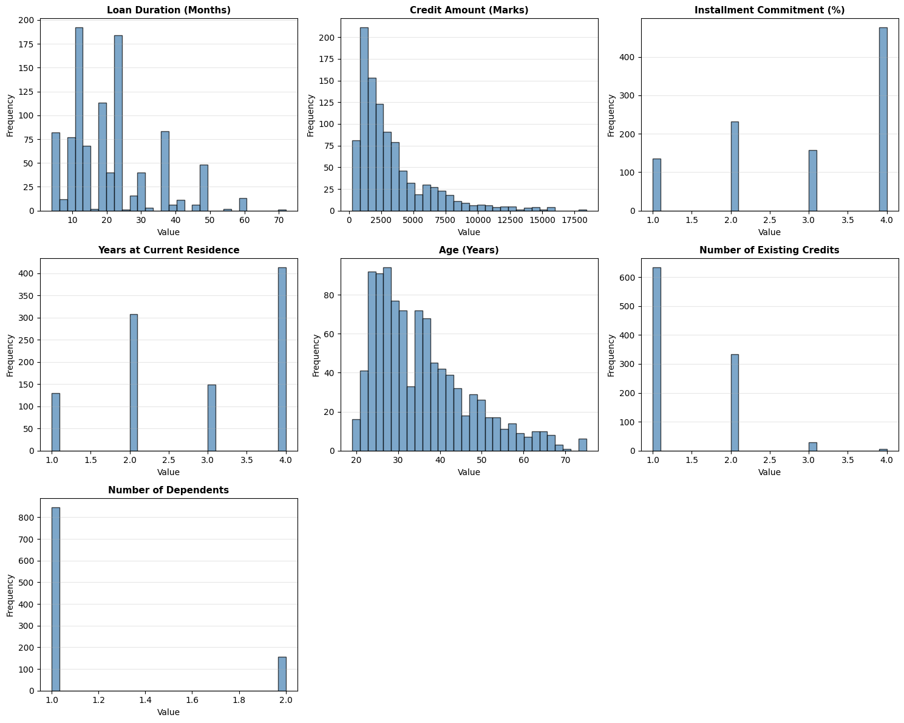
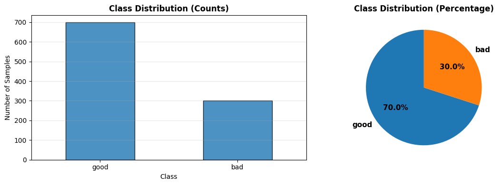
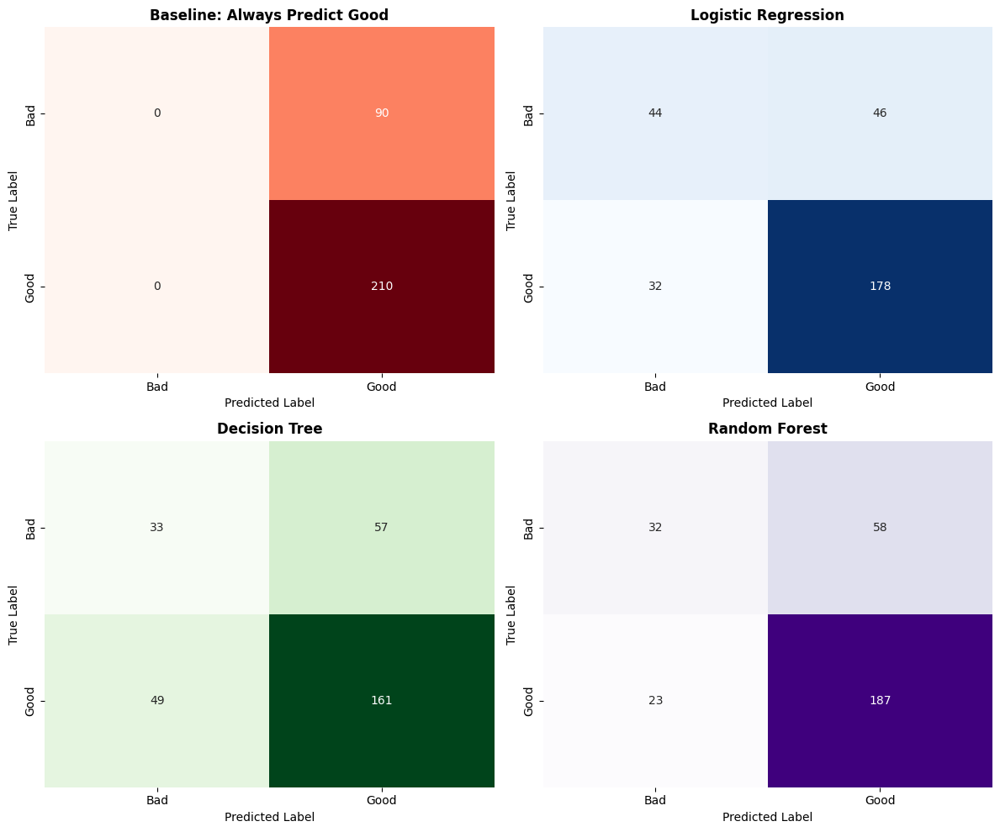
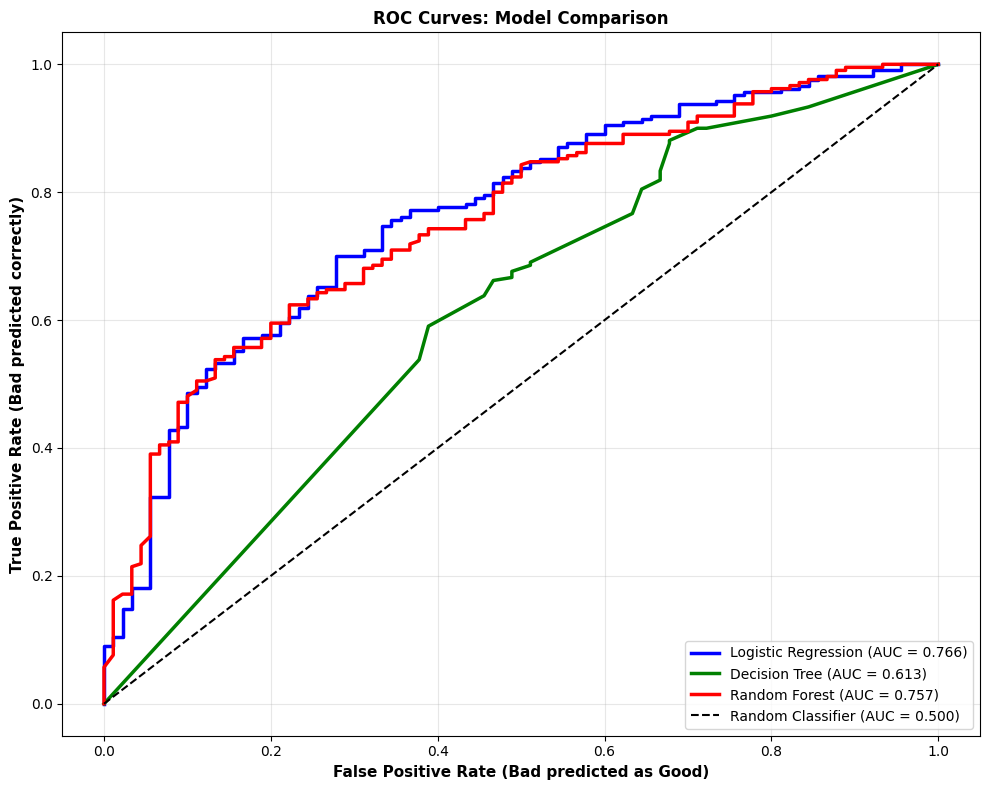
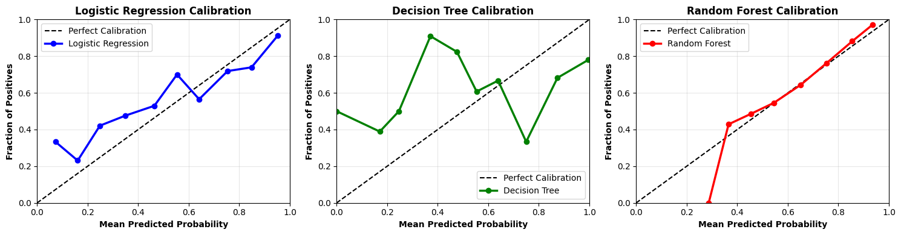
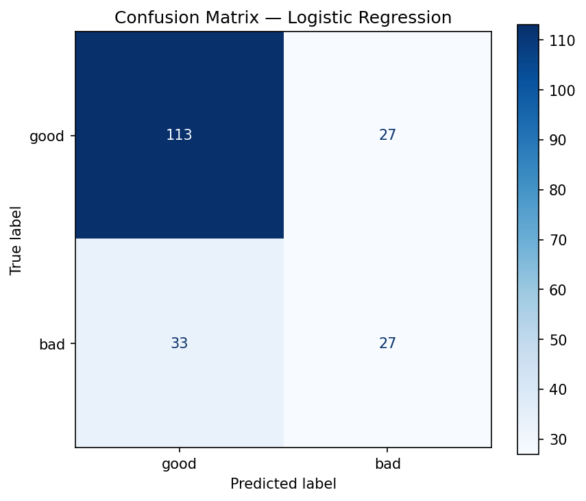
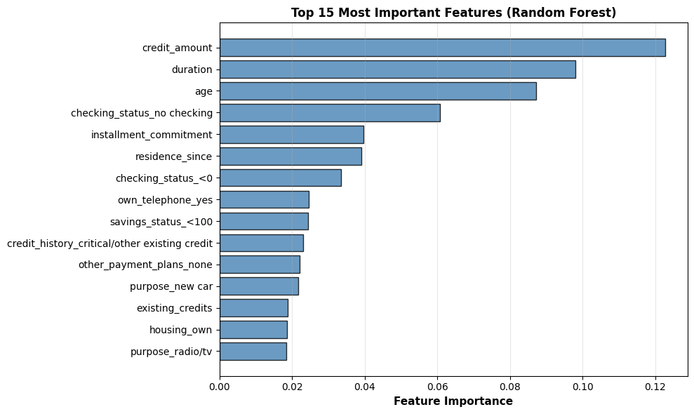

# German Credit Dataset — Classification Pipeline

## Overview

This project applies a complete machine learning classification pipeline to the **German Credit dataset**. Unlike the previous controlled/synthetic datasets, this dataset contains real-world categorical and numerical features, class imbalance, and more complex relationships.

The goal is to predict whether a credit applicant is **Good** or **Bad** based on their financial and personal information.

The complete workflow includes data exploration, preprocessing, feature encoding, baseline comparison, model training, evaluation, ROC-AUC analysis, calibration, error analysis, and feature importance.

---

## Objectives

* Explore a real-world classification dataset.
* Understand numerical and categorical feature distributions.
* Identify class imbalance.
* Handle categorical variables using one-hot encoding.
* Create a stratified train-test split.
* Establish a simple baseline.
* Train multiple classification models.
* Compare models using multiple evaluation metrics.
* Analyze ROC curves and ROC-AUC.
* Evaluate probability calibration.
* Perform confusion-matrix-based error analysis.
* Interpret Random Forest feature importance.

---

## Dataset

The German Credit dataset contains **1,000 credit applicants** with information about their credit history, financial situation, employment, housing, and other characteristics.

### Dataset Statistics

| Property        |   Value |
| --------------- | ------: |
| Samples         |   1,000 |
| Raw Features    |      20 |
| Target          | `class` |
| Good Applicants |     700 |
| Bad Applicants  |     300 |
| Good Class      |     70% |
| Bad Class       |     30% |
| Good:Bad Ratio  |  2.33:1 |
| Missing Values  |       0 |
| Duplicate Rows  |       0 |

The dataset was loaded using `fetch_openml()` from scikit-learn.

---

## Target Variable

The original target contains two classes:

* `good`
* `bad`

For binary classification, the target was encoded as:

```text
0 = Good
1 = Bad
```

This encoding makes **Bad credit the positive class**, which is important when interpreting Precision, Recall, F1-Score, ROC-AUC, confusion matrices, and calibration curves.

---

## Exploratory Data Analysis

### Numerical Features

The numerical features include:

* `duration`
* `credit_amount`
* `installment_commitment`
* `residence_since`
* `age`
* `existing_credits`
* `num_dependents`

### Key Observations

* `credit_amount` is strongly right-skewed, with a smaller number of applicants having relatively large credit amounts.
* `duration` contains mostly short-to-medium repayment periods.
* `age` is concentrated around younger and middle-aged applicants.
* `existing_credits` and `num_dependents` have relatively narrow ranges.
* Several numerical variables are discrete or ordinal rather than continuous.



---

## Class Distribution

The target variable is moderately imbalanced:

* **70% Good**
* **30% Bad**

This means a model predicting every applicant as Good can achieve approximately **70% accuracy** without identifying any Bad applicants.

Therefore, accuracy alone is not sufficient for evaluating this problem.



---

## Fairness Consideration

The `personal_status` feature combines gender and marital-status information. It was excluded from the model features to reduce direct use of gender-related information.

However, removing this feature **does not guarantee fairness**, because other variables may still contain indirect demographic information.

The analysis of extracted gender information showed differences in observed Bad-credit rates between groups. These differences are descriptive and should not be interpreted as causal evidence.

---

## Data Preprocessing

### Feature Selection

The raw dataset contains both numerical and categorical variables.

The target column `class` was separated from the predictors.

The `personal_status` feature was excluded because it contains gender-related information.

### One-Hot Encoding

Categorical predictors were converted into numerical features using:

```python
pd.get_dummies(
    X_raw,
    columns=categorical_cols,
    drop_first=True,
    dtype=int
)
```

Before encoding:

```text
X shape = (1000, 19)
```

After encoding:

```text
X shape = (1000, 45)
```

`drop_first=True` was used to remove one reference category from each categorical variable and avoid redundant dummy variables.

---

## Train-Test Split

The dataset was divided into:

* **70% training data**
* **30% testing data**

A stratified split was used to preserve the Good/Bad class distribution:

```python
train_test_split(
    X,
    y,
    test_size=0.3,
    random_state=42,
    stratify=y
)
```

This resulted in:

```text
Training samples: 700
Testing samples: 300
```

The training set contains:

```text
Good: 490
Bad: 210
```

The test set contains:

```text
Good: 210
Bad: 90
```

---

## Baseline Model

A simple baseline was created by predicting **Good (0)** for every test sample.

Because 70% of the test set belongs to the Good class, this baseline achieves:

```text
Accuracy = 70%
Precision = 0%
Recall = 0%
F1-Score = 0%
```

The baseline demonstrates why accuracy can be misleading in an imbalanced classification problem.

A useful model should not only improve accuracy but should also identify Bad applicants.

---

## Feature Scaling

`StandardScaler` was applied to the training and test features for Logistic Regression.

```python
scaler = StandardScaler()

X_train_scaled = scaler.fit_transform(X_train)
X_test_scaled = scaler.transform(X_test)
```

The scaler was fitted only on the training data to avoid data leakage.

Tree-based models were trained on the unscaled features because Decision Trees and Random Forests do not generally require feature scaling.

---

## Models

Three classification models were trained:

### 1. Logistic Regression

Logistic Regression was used as a linear classification model.

It estimates the probability of the positive class, where:

```text
1 = Bad
```

It provides a useful baseline for understanding how well a relatively simple linear model performs on the dataset.

### 2. Decision Tree

A Decision Tree classifies applicants by creating a sequence of decision rules based on feature values.

The model used:

```python
DecisionTreeClassifier(
    max_depth=10,
    min_samples_split=10,
    random_state=42
)
```

### 3. Random Forest

Random Forest combines multiple decision trees and aggregates their predictions.

The model used:

```python
RandomForestClassifier(
    n_estimators=100,
    max_depth=15,
    random_state=42,
    n_jobs=-1
)
```

Random Forest can capture more complex nonlinear relationships than Logistic Regression.

---

## Evaluation Metrics

The models were evaluated using:

### Accuracy

Measures the overall proportion of correct predictions.

### Precision

Measures how many applicants predicted as Bad were actually Bad.

### Recall

Measures how many actual Bad applicants were correctly identified.

### F1-Score

Combines Precision and Recall into a single metric.

### ROC-AUC

Measures how well the model separates Good and Bad applicants across different probability thresholds.

Because the dataset is imbalanced, **Precision, Recall, F1-Score, and ROC-AUC** provide more useful information than accuracy alone.

---

## Model Comparison

| Model               | Accuracy | Precision | Recall | F1-Score | ROC-AUC |
| ------------------- | -------: | --------: | -----: | -------: | ------: |
| Logistic Regression |    74.0% |     79.5% |  84.8% |    82.0% |   0.766 |
| Decision Tree       |    64.7% |     73.9% |  76.7% |    75.2% |   0.613 |
| Random Forest       |    73.0% |     76.3% |  89.0% |    82.2% |   0.757 |

### Comparison

* Logistic Regression achieved the highest **ROC-AUC**.
* Random Forest achieved a very similar ROC-AUC while providing strong classification performance.
* Decision Tree performed weakest overall.
* The tree-based models were able to capture nonlinear patterns, but the single Decision Tree was less effective than the ensemble Random Forest.
* The results show that a more complex model does not automatically guarantee better performance.

---

## Confusion Matrix Analysis

Confusion matrices were used to examine the types of classification errors made by each model.

Since:

```text
0 = Good
1 = Bad
```

the positive class represents Bad applicants.



### Error Types

**False Positive (FP):**

A Good applicant predicted as Bad.

This may result in unnecessarily rejecting a creditworthy applicant.

**False Negative (FN):**

A Bad applicant predicted as Good.

This is particularly important in credit-risk applications because it may result in approving a higher-risk applicant.

---

## ROC-AUC Analysis

ROC-AUC was used to measure the models' ability to distinguish between Good and Bad applicants across different classification thresholds.

Unlike Accuracy, Precision, Recall, and F1-Score, which evaluate predictions at a particular threshold, ROC-AUC evaluates the model's ranking ability using predicted probabilities.

A higher ROC-AUC indicates better discrimination, while:

```text
ROC-AUC = 0.50
```

represents approximately random classification.

### Results

* **Logistic Regression:** ROC-AUC ≈ 0.766
* **Random Forest:** ROC-AUC ≈ 0.757
* **Decision Tree:** ROC-AUC ≈ 0.613

Logistic Regression provided the strongest overall class discrimination among the three models.



---

## Calibration Analysis

Calibration evaluates whether predicted probabilities reflect actual observed outcomes.

The key question is:

> When the model predicts **P(Bad) = 0.7**, are approximately 70% of those applicants actually Bad?

A model closer to the diagonal calibration line provides more reliable probability estimates.



### Findings

* **Logistic Regression** showed the strongest overall calibration.
* **Decision Tree** showed larger deviations from the calibration line.
* **Random Forest** showed reasonable calibration in parts of the probability range but had noticeable deviations.

### Overall Finding

Logistic Regression provided the most reliable probability estimates among the evaluated models.

This is useful when model probabilities are used for risk-based decisions rather than only making Good/Bad predictions.

---

## Error Analysis

Random Forest predictions were further analyzed using the confusion matrix.

The test set contained **300 applicants**, and the model made **81 classification errors**.

The errors included:

* **23 False Positives:** Good applicants predicted as Bad.
* **58 False Negatives:** Bad applicants predicted as Good.

False Negatives were more frequent than False Positives.

### Key Insight

In credit-risk classification, False Negatives are particularly important because they represent Bad applicants incorrectly classified as Good.

This can potentially lead to higher credit-loss risk.



---

## Random Forest Feature Importance

Feature importance was extracted from the Random Forest model to identify which features contributed most to its decision-making.



### Top Important Features

The most important features included:

1. `credit_amount`
2. `duration`
3. `age`
4. `checking_status_no checking`
5. `installment_commitment`
6. `residence_since`
7. `checking_status_<0`
8. `own_telephone_yes`
9. `savings_status_<100`
10. `credit_history_critical/other existing credit`

### Interpretation

* **Credit amount** was the most important feature.
* **Duration** and **age** also had substantial importance.
* Different categories of **checking status** contributed noticeably to the model.
* Other important variables included installment commitment, residence, savings status, and credit history.

Feature importance indicates the relative contribution of features to Random Forest splits. It does **not** indicate whether a feature increases or decreases Bad-credit risk.

---

## Key Findings

* The dataset contained a moderate class imbalance with 70% Good and 30% Bad applicants.
* A simple baseline achieved 70% accuracy by always predicting Good.
* This demonstrated that accuracy alone can be misleading.
* Logistic Regression achieved the strongest ROC-AUC.
* Random Forest produced competitive overall classification performance.
* Decision Tree performed worse than both Logistic Regression and Random Forest.
* Logistic Regression showed the most reliable calibration among the evaluated models.
* Random Forest feature importance highlighted credit amount, duration, age, and checking status as influential features.
* False Negatives were more common than False Positives in the analyzed Random Forest predictions.

---

## Reflection

Working with the German Credit dataset was different from working with the earlier controlled datasets because the data was more messy and less predictable.

The categorical features had many different values, and deciding how to encode and interpret them required more care. I also had to pay more attention to class imbalance and select evaluation metrics beyond accuracy.

One thing that stood out was that the baseline already achieved 70% accuracy simply by predicting the majority class. This showed me how accuracy can give a misleading impression of model performance.

Overall, this task helped me understand that real-world machine learning requires careful preprocessing, appropriate evaluation metrics, error analysis, and interpretation rather than simply trying to maximize accuracy.

---

## Technologies Used

* Python
* Pandas
* NumPy
* Matplotlib
* Seaborn
* Scikit-learn
* Jupyter Notebook
* Git & GitHub

---

## Project Structure

```text
Day5/
│
├── german_credit_complete.ipynb
├── README.md
├── requirements.txt
│
├── 01_numerical_distributions.png
├── 02_class_distribution.png
├── 03_confusion_matrices.png
├── 04_roc_curves.png
├── 05_calibration_curves.png
├── 06_feature_importance.png
└── chart_confusion_matrix.png
```

### File Description

| File                             | Description                                    |
| -------------------------------- | ---------------------------------------------- |
| `german_credit_complete.ipynb`   | Complete German Credit classification pipeline |
| `README.md`                      | Project documentation and analysis             |
| `requirements.txt`               | Required Python dependencies                   |
| `01_numerical_distributions.png` | Numerical feature distributions                |
| `02_class_distribution.png`      | Good vs Bad class distribution                 |
| `03_confusion_matrices.png`      | Confusion matrices for the trained models      |
| `04_roc_curves.png`              | ROC curves and AUC comparison                  |
| `05_calibration_curves.png`      | Model calibration curves                       |
| `06_feature_importance.png`      | Random Forest feature importance               |
| `chart_confusion_matrix.png`     | Additional confusion matrix visualization      |

---

## Conclusion

The German Credit dataset provided a more realistic classification problem with mixed data types, categorical variables, class imbalance, and more challenging prediction patterns.

The analysis demonstrated the importance of using a complete ML workflow rather than relying on a single metric. Logistic Regression provided the strongest ROC-AUC and calibration, while Random Forest achieved competitive classification performance and offered useful feature-importance insights.

The task reinforced that in real-world classification problems, **model evaluation, probability reliability, error analysis, and interpretability are just as important as predictive accuracy**.
